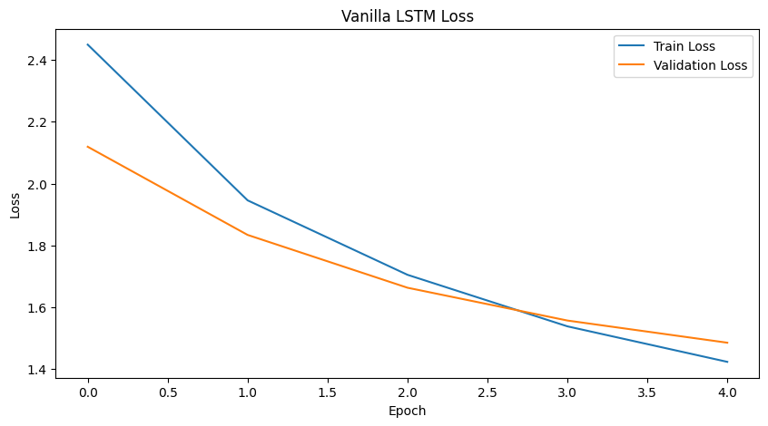
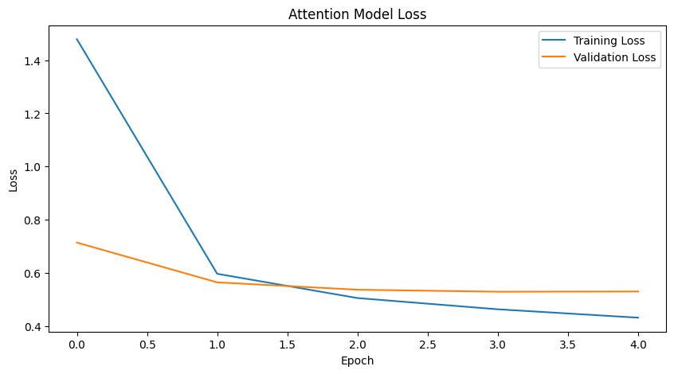
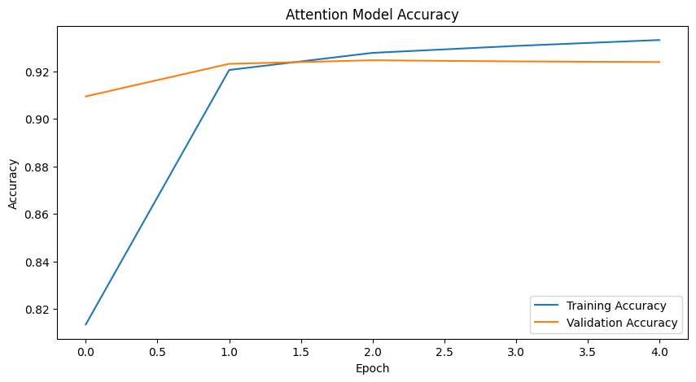
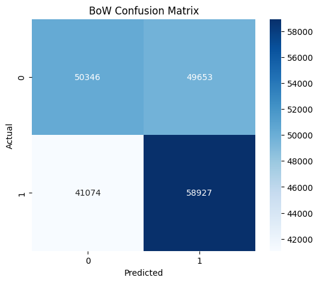

# Grammar Error Correction (GEC)
> **CIE 555 — Neural Networks and Deep Learning**  
> University of Science and Technology, Zewail City · Spring 2026  
> **Status: 🚧 Work in Progress — Transformer (from scratch) training and final evaluation ongoing**

---

## Overview

A full deep learning pipeline for **Grammar Error Correction** on the C4-200M dataset, comparing five progressively more powerful architectures — from a BoW baseline to a fine-tuned T5 Transformer.

---

## Central Question

> **Can deep learning models reliably detect and correct grammatical errors in natural English text? And does architecture choice matter as much as pretraining?**

**Short answer: Yes to both — and T5 makes the gap obvious.**

---

## Dataset

| Property | Details |
|----------|---------|
| Source | C4-200M (Colossal Clean Crawled Corpus) |
| Format | Tab-separated (incorrect, correct) sentence pairs |
| Samples — LSTM / Transformer | 1,000,000 |
| Samples — BoW | 500,000 |
| Samples — T5 fine-tuning | 100,000 |
| Preprocessing | Lowercase, whitespace normalization, `<start>`/`<end>` tokens |

---

## Models

### 1. Bag of Words Baseline
- Reformulates GEC as binary classification (correct vs incorrect sentence)
- CountVectorizer (10K features) + Dense(128) → Dropout → Dense(64) → Dropout → Dense(1, sigmoid)
- Binary cross-entropy, Adam, batch size 512, 3 epochs
- **Limitation**: ignores word order entirely — cannot detect structural errors

### 2. Vanilla LSTM (Seq2Seq)
- Encoder-Decoder architecture
- Embedding(30K, 256) → LSTM(256) encoder → LSTM(256) decoder → Dense(30K, softmax)
- **Limitation**: information bottleneck — entire sentence compressed to fixed-length vector

### 3. LSTM with Attention
- Same architecture + Keras `Attention()` layer between encoder outputs and decoder
- Attention allows the decoder to selectively focus on erroneous input positions
- **Val accuracy: ~92.4% | Val loss: ~0.53** — 64% loss reduction vs vanilla LSTM

### 4. Transformer (from Scratch)
- Custom PositionalEmbedding + TransformerEncoder (8 heads, FF dim 256)
- Dropout(0.3) + Dense(VOCAB_SIZE, softmax)
- Processes all positions in parallel via self-attention

### 5. 🏆 T5-Small Fine-Tuned (Best Model)
- Pretrained `t5-small` (60M parameters) fine-tuned on 100K GEC pairs
- Input format: `"grammar: <incorrect sentence>"` → corrected sentence
- AdamW lr=3e-5, batch size 8, 3 epochs, beam search (5 beams)
- **Produces the most fluent, contextually accurate corrections of all models**

---

## Results

### Training Curves

**Vanilla LSTM Loss:**


**LSTM + Attention Loss:**


**LSTM + Attention Accuracy:**


### BoW Confusion Matrix


### Model Comparison

| Model | Val Loss | Val Accuracy | Can Correct? |
|-------|----------|-------------|--------------|
| BoW + Dense | — | — | No (classify only) |
| Vanilla LSTM | ~1.49 | — | Yes |
| LSTM + Attention | ~0.53 | **92.4%** | Yes |
| Transformer (scratch) | — | — | Yes |
| **T5-small (fine-tuned)** | **Best** | **Best** | **Yes (fluent)** |

---

## T5 Correction Examples

| Incorrect | T5 Corrected | Grammar Rule |
|-----------|-------------|--------------|
| she go to the market every day | She goes to the market every day | Subject-verb agreement |
| yesterday he runs to school | Yesterday he ran to school | Tense consistency |
| he is an honest man and a european | He is an honest man and a European | Capitalization of proper nouns |

---

## Final Challenge: Does C4 Contain Noise?

**Yes.** C4-200M was constructed using automated heuristics, not human annotation. Three categories of noise were identified:
1. **Punctuation-only pairs** — labeled as grammar corrections, not actual rule violations
2. **Capitalization-only pairs** — technically correct but dilute the dataset with trivial examples
3. **Near-identical pairs** — minimal edit distance, causing the BoW classifier to learn wrong patterns

T5 is the most robust to this noise due to its pretrained grammatical knowledge.

---

## Tech Stack

- **Python 3**
- **TensorFlow / Keras** — BoW, LSTM, Attention, Transformer
- **PyTorch + HuggingFace Transformers** — T5 fine-tuning
- **scikit-learn** — metrics, vectorizer
- **Pandas, NumPy** — data handling

---

## File Structure

```
├── Grammar_Error_Correction_Project_GEC.ipynb   # Full pipeline
├── Grammar_Error_Correction_Report.pdf                                    # Written report
├── images/                                       # All plots
└── README.md
```

---


> Dataset available at: [C4-200M on Kaggle](https://www.kaggle.com/datasets/dariocioni/c4200m)

---

## Author

**Ahmed Gamal** — [@AhmedGamal04](https://github.com/AhmedGamal04)
